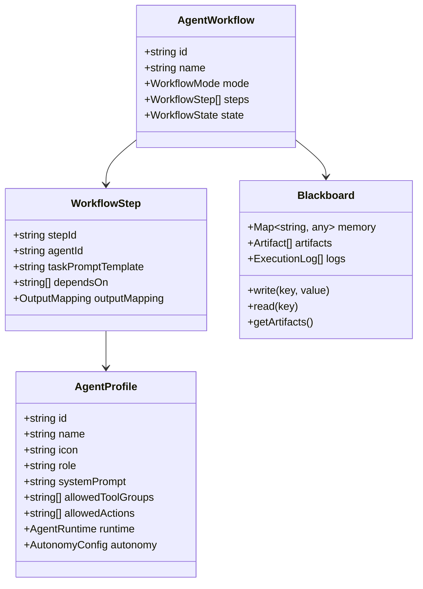
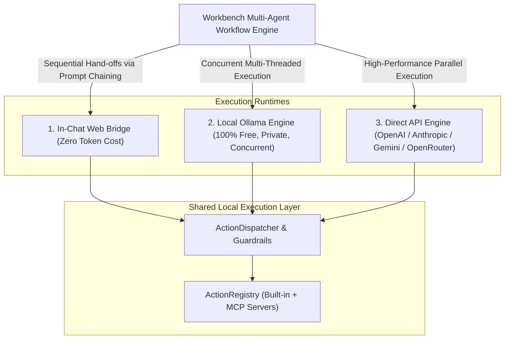
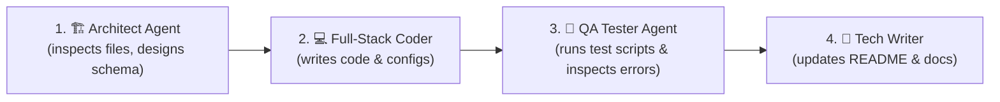
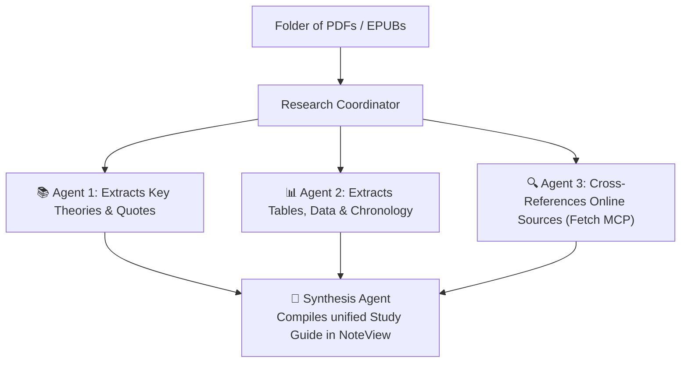

# Multi-Agent Framework Architecture for Workbench
### Independent Design • Concurrent Swarms • Sequential Pipelines

This document defines the architectural blueprint for a **Multi-Agent System** in Workbench where multiple specialized agents are designed independently and can execute **concurrently (in parallel)** or **sequentially (in pipelines/chains)** to solve complex workflows.

---

## 1. Core Vision & Requirements

In modern agentic systems, single general-purpose prompts struggle with complex, multi-faceted workflows. Instead, decomposing work across **specialized, independent agents** yields higher accuracy, lower token usage, and superior reliability.

Workbench requires:
1. **Independent Agent Design**: Each agent is authored with its own identity, system persona, scoped tool permissions (built-in actions + MCP servers), and input/output contracts.
2. **Sequential Execution (Pipelines / Hand-offs)**: Output from Agent A flows into Agent B, then Agent C (e.g., *Researcher $\to$ Architect $\to$ Coder $\to$ Tester*).
3. **Concurrent Execution (Parallel Swarms / Fan-Out Fan-In)**: Multiple agents execute simultaneously across different subtasks (e.g., Agent 1 inspects frontend files while Agent 2 queries the database, and an Aggregator combines their insights).
4. **Hierarchical Delegation (Orchestrator-Worker)**: A primary lead agent dynamically delegates subtasks to specialized worker agents and coordinates their results.
5. **Shared State (Blackboard / Workspace Context)**: A persistent shared context and memory space where agents exchange artifacts, intermediate findings, and structured outputs.

---

## 2. Multi-Agent Topologies Supported

Workbench supports three fundamental multi-agent execution topologies:

```mermaid
graph TD
    subgraph Topologies [Multi-Agent Execution Topologies]
        direction TB

        subgraph Sequential_Pipeline [1. Sequential Pipeline - Chain / Hand-off]
            A1["Agent A (Researcher)"] -->|Context & Findings| A2["Agent B (Architect)"]
            A2 -->|Design Spec| A3["Agent C (Coder)"]
            A3 -->|Generated Files| A4["Agent D (QA Reviewer)"]
        end

        subgraph Parallel_Swarm [2. Concurrent Swarm - Fan-Out / Fan-In]
            Input["Task Input"] --> Dispatcher["Swarm Dispatcher"]
            Dispatcher --> S1["Agent 1: Web Docs"]
            Dispatcher --> S2["Agent 2: Local Codebase"]
            Dispatcher --> S3["Agent 3: SQLite DB"]
            S1 --> Reducer["Aggregator / Synthesizer"]
            S2 --> Reducer
            S3 --> Reducer
            Reducer --> Output["Unified Report / Action"]
        end

        subgraph Hierarchical_Team [3. Orchestrator-Worker - Dynamic Delegation]
            Lead["Lead Agent (Orchestrator)"]
            Lead <-->|Task 1 / Result| W1["Worker: Coder"]
            Lead <-->|Task 2 / Result| W2["Worker: SQL Analyst"]
            Lead <-->|Task 3 / Result| W3["Worker: Browser Automator"]
        end
    end
```



---

## 3. Core Architectural Abstractions



### 3.1. `AgentProfile` (The Independent Agent)
Every agent is a decoupled entity that can run standalone or as part of a team:
```typescript
export interface AgentProfile {
  id: string                          // e.g. "software-architect"
  name: string                        // e.g. "Software Architect"
  icon: string                        // e.g. "🏗️"
  role: string                        // "Designs system layouts and specifies file trees"
  category: 'coding' | 'research' | 'data' | 'automation' | 'custom'
  
  // Independent System Prompt & Persona
  systemPrompt: string
  responseFormat?: 'json' | 'markdown' | 'code' | 'raw'
  
  // Scoped Capabilities (Zero Unnecessary Tools)
  allowedGroupIds: string[]          // e.g. ['core', 'files', 'mcp_fetch']
  customActionIds?: string[]         // e.g. ['inspect_folder', 'read_file']
  
  // Execution Backend & Autonomy
  runtime: {
    preferredBackend: 'web-bridge' | 'api' | 'ollama' | 'auto'
    model?: string                   // e.g. 'llama3:8b', 'gpt-4o', 'claude-3-5-sonnet'
    temperature?: number
  }
  autonomy: {
    maxConsecutiveToolCalls: number  // Circuit-breaker ceiling (e.g. 5 steps)
    requireApprovalFor: string[]     // e.g. ['delete_file', 'run_script']
  }
}
```

### 3.2. `AgentWorkflow` (Orchestration Specification)
Defines how multiple agents collaborate:
```typescript
export type WorkflowMode = 'sequential' | 'parallel' | 'orchestrated' | 'dag'

export interface WorkflowStep {
  stepId: string
  name: string
  agentId: string                     // Reference to AgentProfile
  promptTemplate: string              // Supports variables e.g. "Analyze {{blackboard.research_output}}"
  dependsOn?: string[]                // IDs of steps that must finish first (for DAG / pipelines)
  outputKey?: string                  // Key under which step output is saved in Blackboard
}

export interface AgentWorkflow {
  id: string
  name: string
  description: string
  mode: WorkflowMode
  steps: WorkflowStep[]
  activeBlackboardId?: string
}
```

### 3.3. `Blackboard` (Shared Context & Communication Bus)
Agents do not communicate via brittle unstructured text blobs alone; they share a typed **Blackboard**:
* **Shared Key-Value Store**: Intermediate summaries, parsed tables, AST trees, URLs.
* **Shared Artifacts Registry**: Files created or modified during the workflow (e.g., `src/App.tsx`, `notes/summary.md`).
* **Event Stream**: Broadcasts step transitions (`STEP_STARTED`, `TOOL_CALLED`, `STEP_COMPLETED`, `STEP_FAILED`).

---

## 4. Execution Engines in Workbench

To execute multiple agents simultaneously or sequentially, Workbench employs a **Multi-Runtime Execution Engine**:



### Runtime 1: In-Chat Web Bridge (Interactive, Zero Token Cost)
* Runs within existing browser subscriptions (ChatGPT Plus, Claude Pro, Gemini Advanced).
* **Sequential Execution**: Workbench automatically chains agents in the chat view:
  1. Primes with Agent 1 persona $\to$ executes task $\to$ intercepts final output.
  2. Injects Agent 2 persona hand-off prompt with Agent 1's artifacts $\to$ executes task $\to$ repeats.
* **Hierarchical Delegation**: The active chat model is equipped with a `delegate_task(agent_id, task)` action. When invoked, Workbench executes the worker agent in the background and returns the result card to the chat.

### Runtime 2: Local Ollama / Open-Source Models (100% Free, Private, Multi-Agent Swarms)
* Connects to a local Ollama instance (`http://localhost:11434`) running lightweight models like `llama3.2`, `qwen2.5-coder`, or `mistral`.
* **True Concurrent Execution**: Runs multiple agents simultaneously using `Promise.all` without external network latency, privacy concerns, or API fees.

### Runtime 3: Headless Direct API (Anthropic / OpenAI / Gemini / OpenRouter)
* For unattended, high-speed concurrent execution where multiple cloud models run in parallel.
* Configured once via user API keys in Workbench Settings.

---

## 5. Built-in Multi-Agent Workflow Templates

Workbench will ship with production-ready multi-agent workflows out of the box:

### Template 1: "The Full-Stack Software Feature Team" (Sequential Pipeline)

* **Execution**: Sequential DAG with rollback on test failure.

### Template 2: "Deep Folder & Book Research Swarm" (Parallel Fan-Out / Fan-In)

* **Execution**: Agents 1, 2, and 3 run concurrently in parallel, feeding into the Synthesis Agent.

### Template 3: "Database & Web Analyst" (Hierarchical Orchestrator)
* **Lead Agent**: Data Strategist.
* **Workers**:
  - `sqlite-analyst`: Queries tables and computes statistics.
  - `web-scraper`: Pulls live benchmark prices via Playwright/Fetch.
  - `chart-builder`: Generates SVG/HTML visualization artifacts.

---

## 6. Frontend: Multi-Agent Mission Control UI

In the Workbench frontend, the user gets a dedicated **Multi-Agent Mission Control**:

```
+-----------------------------------------------------------------------------------------+
| [ Multi-Agent Studio ]  Active Workflow: 🚀 Full-Stack Feature Team     [ Run Workflow ] |
+-----------------------------------------------------------------------------------------+
|  WORKFLOW PROGRESS                                                                      |
|  [✓] 1. Architect (Done)   -->  [●] 2. Coder (Executing...)   -->  [ ] 3. QA Tester     |
+-----------------------------------------------------------------------------------------+
|  CONCURRENT AGENT LANES                                                                 |
|  +------------------------------+  +------------------------------+                     |
|  | 💻 Agent: Full-Stack Coder   |  | 📊 Agent: SQL Analyst (MCP)  |                     |
|  | Status: Writing src/auth.ts  |  | Status: Idle (Completed)     |                     |
|  | Active Tools: write_file     |  | Output: 4 tables verified    |                     |
|  | [View Real-Time Logs]        |  | [View Blackboard Artifact]   |                     |
|  +------------------------------+  +------------------------------+                     |
+-----------------------------------------------------------------------------------------+
|  SHARED BLACKBOARD (State & Artifacts)                                                  |
|  • File: src/services/authService.ts (Updated 12s ago by Coder)                          |
|  • Context: { "db_schema_version": 4, "endpoints": ["/login", "/register"] }           |
+-----------------------------------------------------------------------------------------+
```

---

## 7. Phased Implementation Roadmap

### Phase 1: Core Data Models & Agent Registry
* **`electron/services/agent/`**:
  * `agentTypes.ts`: Type definitions for `AgentProfile`, `AgentWorkflow`, `WorkflowStep`, `Blackboard`.
  * `agentRegistry.ts`: Decoupled persistence for independent agent profiles in `userData/workbench-agents.json`.
  * `blackboard.ts`: In-memory and disk-backed shared state bus.

### Phase 2: Workflow Execution Engine
* **`electron/services/agent/workflowEngine.ts`**:
  * Sequential execution runner (resolves dependencies, pipes outputs).
  * Parallel execution runner (concurrent promises with concurrency limiter).
  * Tool scope enforcement (each agent only accesses its assigned action whitelist).

### Phase 3: Runtime Drivers (Web Bridge + Ollama / API)
* **`electron/services/agent/runtimes/`**:
  * `webBridgeRuntime.ts`: Orchestrates sequential hand-offs and `delegate_task` inside existing web views.
  * `ollamaRuntime.ts`: Driver for local models (zero token cost, parallel-capable).
  * `apiRuntime.ts`: Direct cloud model driver.

### Phase 4: Mission Control UI (React)
* **`src/components/agents/`**:
  * `AgentStudioModal.tsx`: Visual editor to design agents independently.
  * `WorkflowBuilderModal.tsx`: Drag-and-drop or checklist pipeline designer.
  * `MissionControlPanel.tsx`: Live multi-agent execution monitor with lanes and blackboard viewer.

---

## 8. Summary of Benefits

| Feature | Single-Agent Setup | Workbench Multi-Agent Framework |
| :--- | :--- | :--- |
| **Specialization** | One bloated prompt with 35+ tools | Lean, focused agents with 3–5 dedicated tools |
| **Concurrency** | One task at a time | Parallel swarms analyzing files, web, and DB at once |
| **Complex Pipelines** | Manual prompt copying between chats | Automated hand-offs with shared state (Blackboard) |
| **Execution Cost** | Expensive token waste on unused tool definitions | Zero token cost via Web Bridge & Ollama, or API when desired |
| **Extensibility** | Hardcoded tool lists | Dynamic MCP attachment per individual agent |
