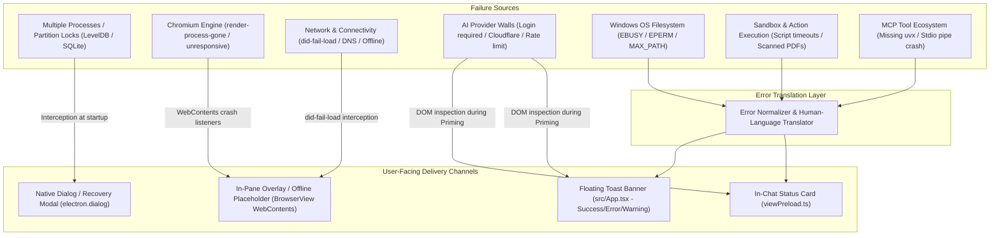

# Workbench — Comprehensive Error Handling & Fault Recovery Specification

**Document Version:** 1.0  
**Status:** Approved Specification  
**Scope:** Electron Main Process, BrowserView Lifecycle, Action Dispatcher, Native Filesystem, MCP Integration, and React Renderer  
**Target:** Elimination of silent failures, raw console dumps, frozen views, and unrendered notifications  

---

## 1. Executive Summary & Problem Statement

Workbench operates as a multi-process desktop workspace embedding third-party web AI providers (ChatGPT, Claude, Gemini, Perplexity) alongside native local filesystem tools and Model Context Protocol (MCP) servers.

Because Workbench interfaces with three inherently unpredictable boundaries—**external web applications**, **the Windows operating system file layer**, and **Chromium's multi-process sandbox**—errors are inevitable. However, a developer-centric console log (`console.error`) or a silent failure leaves end users stranded without functional guidance.

### The Trigger Incidents
1. **Chromium LevelDB Partition Lock:**
   ```text
   [50196:1009/114829.461:ERROR:backing_store.cc(202)] Failed to open LevelDB database from 
   C:\Users\...\AppData\Roaming\workbench\Partitions\workbench-ai-claude\IndexedDB\https_claude.ai_0.indexeddb.leveldb,
   IO error: .../LOCK: Access denied. (ChromeMethodBFE: 15::LockFile::5)
   ```
   *Root Cause:* Launching a second instance of Workbench or reloading the dev server while an orphaned Electron process holds an exclusive Windows lock on Chromium's partition storage.

2. **The Silent Notification Gap:**
   *Root Cause:* In `src/App.tsx`, `notification` state was stored via `showNotification(msg)`, but **was never mounted or rendered in the JSX hierarchy**. Simultaneously, backend handlers dispatched `workbench:toast` while `preload.ts` listened only for `workbench:notify`. Even when errors were caught, the user remained completely blind to them.

---

## 2. High-Level Architecture: Error Detection & Recovery Pipeline



---

## 3. Catalog of Critical Error Conditions (7 Core Domains)

### Domain 1: Multi-Instance & Chromium Storage Locks

| Condition | Failure Trigger | Current Behavior | Functional User-Facing Solution |
| :--- | :--- | :--- | :--- |
| **Secondary Instance Collision** | User launches Workbench while an existing instance is already running. | Process #2 crashes on LevelDB/Cookie store with `LOCK: Access denied (LockFile::5)`. | **Single Instance Guard:** `app.requestSingleInstanceLock()`. Process #2 focuses existing window and exits silently. |
| **Orphaned LevelDB Lock File** | System reboot, bluescreen, or hard taskkill leaves `.lock` or `LOCK` file on disk. | Subsequent startup throws `backing_store.cc Failed to open LevelDB`. | Catch partition open errors at startup. Display modal: *"Session data is temporarily locked by a background process. [Clean Temporary Locks & Restart]"*. |
| **SQLite Session Lock** | Multiple BrowserViews attempt concurrent write access to the same SQLite partition. | Cookies/Local Storage fails to persist across reloads. | Ensure each provider uses a strictly isolated partition (`persist:workbench-ai-{sourceId}`). |

---

### Domain 2: Chromium Engine & BrowserView Crashes

| Condition | Failure Trigger | Current Behavior | Functional User-Facing Solution |
| :--- | :--- | :--- | :--- |
| **Render Process Gone (`oom` / `crashed`)** | Long ChatGPT/Claude chats accumulate 10,000+ DOM nodes, exceeding V8 memory limits. | Tab turns solid white or solid black; UI becomes dead with 0 logs. | Listen to `wc.on('render-process-gone')`. Render inline recovery card: *"⚠️ The ChatGPT/Claude tab ran out of memory. [🔄 Reload Tab]"*. |
| **Tab Unresponsive (Script Hang)** | Heavy web worker calculations or infinite JavaScript loops in provider page. | Pane stops accepting clicks and scroll; whole app feels laggy. | Listen to `wc.on('unresponsive')`. Show floating warning: *"⏳ This AI tab is taking longer than usual to respond. [Wait] [Force Reload]"*. |
| **Tab Responsive Recovery** | Page completes heavy processing and thread unblocks. | N/A | Listen to `wc.on('responsive')`. Automatically dismiss warning toast. |

---

### Domain 3: Network, Connectivity & Security Load Errors

| Condition | Failure Trigger | Current Behavior | Functional User-Facing Solution |
| :--- | :--- | :--- | :--- |
| **Network Disconnected (`net::ERR_INTERNET_DISCONNECTED`)** | Wi-Fi disconnects or ethernet cable unplugged. | Silent `console.warn` in terminal; view displays blank screen. | Intercept `wc.on('did-fail-load')` when `errorCode !== -3`. Load an internal offline HTML view with a *"Check Connection & Retry"* button. |
| **DNS Resolution Failure (`net::ERR_NAME_NOT_RESOLVED`)** | Provider domain blocked or DNS server down. | Silent terminal warning. | In-pane card: *"Cannot locate claude.ai. Verify your internet connection or VPN settings. [Retry]"*. |
| **Connection Timeout (`net::ERR_CONNECTION_TIMED_OUT`)** | Slow proxy or provider outage. | Blank screen after 30s. | In-pane card: *"Connection to provider timed out. [Reload Page]"*. |
| **SSL / Certificate Error** | Captive portal (hotel/airport Wi-Fi) intercepting HTTPS. | White screen or Chromium cert reject. | Show security warning: *"Secure connection could not be established. You may need to log into your network portal."* |

---

### Domain 4: AI Platform Barriers (Auth, CAPTCHAs, Rate Limits & DOM Drift)

| Condition | Failure Trigger | Current Behavior | Functional User-Facing Solution |
| :--- | :--- | :--- | :--- |
| **Authentication Wall (Not Logged In)** | User clicks *"⚡ Prime Chat"* or dispatches an action while on `chatgpt.com/auth/login` or `claude.ai/login`. | Fails silently with *"Chat input field not found"*; button stays unprimed. | Detect login URL/buttons in DOM. Toast & In-chat card: *"🔐 Please log in to ChatGPT / Claude before priming Workbench."* |
| **Cloudflare Turnstile / Bot Challenge** | Cloudflare interstitial *"Verify you are human"* appears before the chat UI loads. | Priming loop waits for input until timeout. | Detect `.cf-turnstile` or `#challenge-running`. Notify: *"🛡️ Cloudflare verification required: Please complete the security check in the chat pane."* |
| **Provider Rate Limit / Capacity Limit** | Claude displays *"Free message limit reached until 4:00 PM"* or ChatGPT shows *"Plus limit reached"*. | Priming / autonomous loop stalls waiting for response stream. | Inspect DOM for quota warning strings. Notify: *"⏳ AI provider usage limit reached. Priming and automation paused until capacity resets."* |
| **DOM Redesign / Input Selector Drift** | Provider updates their web frontend class names or DOM structure. | Injection fails with generic error. | Fallback multi-selector strategy with diagnostics: *"Could not locate chat input. Please click inside the chat box manually and retry."* |
| **File Conversion Threshold (Claude)** | Prompt exceeds 1,500 characters, causing Claude to convert text into a `.txt` attachment badge. | AI does not receive prompt instructions as direct text. | Dedicated compact prompts per provider (<1,500 chars for Claude) with length pre-validation. |

---

### Domain 5: Windows OS & File System Resource Locks

| Condition | Failure Trigger | Current Behavior | Functional User-Facing Solution |
| :--- | :--- | :--- | :--- |
| **File Open in External App (`EBUSY`)** | AI edits a Word document (`.docx`), Excel file, or note currently open in Office. | Raw error: `❌ Action failed: EBUSY: resource busy or locked, open '...'`. | **Error Translation:** *"📄 File is locked by another program (e.g., Microsoft Word, Excel). Please close the document and retry."* |
| **Cloud Sync Lock (`EBUSY` / OneDrive)** | OneDrive or Dropbox is actively uploading a newly created file. | File write or delete fails with lock error. | Automatic 3-step exponential retry (100ms, 300ms, 800ms) before prompting user. |
| **Permission Denied (`EPERM` / `EACCES`)** | File is marked Read-Only or target path is in `C:\Program Files` without elevation. | Raw error: `EPERM: operation not permitted`. | **Error Translation:** *"⚠️ Permission denied: File is marked Read-Only or requires Administrator permissions."* |
| **Windows MAX_PATH (> 260 chars)** | Deeply nested workspace directory causes path length overflow. | Operations fail with `ENOENT` or silent truncation. | Warn user upon workspace selection if path exceeds 200 characters: *"Path is near Windows 260-character limit."* |
| **Invalid Windows Filename Characters** | AI attempts to create file with `<`, `>`, `:`, `"`, `/`, `\`, `\|`, `?`, `*`. | Node `fs` throws invalid argument error. | Auto-sanitize invalid filename characters with `_` and notify: *"Sanitized filename to remove invalid Windows characters."* |
| **Disk Space Exhaustion (`ENOSPC`)** | Target drive runs out of free disk space. | Unhandled write rejection. | **Error Translation:** *"⚠️ Disk full: Unable to write file. Please free up space on drive."* |

---

### Domain 6: Action Sandbox & Script Execution Errors

| Condition | Failure Trigger | Current Behavior | Functional User-Facing Solution |
| :--- | :--- | :--- | :--- |
| **Script Execution Timeout** | Infinite loop in user script or slow PowerShell command. | Electron hangs or hits unhelpful race timeout. | Hard 10-second cap with SIGKILL on child processes. Clear message: *"⏱️ Script timed out after 10s and was safely terminated."* |
| **Missing Interpreter (`ENOENT` for Python)** | User executes Python script, but `python.exe` is not installed or not in PATH. | Raw `spawn python ENOENT`. | **Error Translation:** *"⚠️ Python interpreter not found. Please install Python and ensure 'Add to PATH' is checked."* |
| **Scanned / Image-Only PDF Extraction** | User reads a scanned contract or textbook PDF with no embedded OCR text. | Returns empty string or 0 characters without explanation. | Detect `charCount === 0`. Surface prompt: *"⚠️ No extractable text found. This document is an image-only scanned PDF without an OCR text layer."* |
| **Encrypted / Password-Protected PDF** | PDF requires password to decrypt. | `pdf-parse` throws parsing exception. | **Error Translation:** *"🔒 This PDF is encrypted or password-protected and cannot be read without a password."* |
| **Corrupted Word Document (`.docx`)** | Corrupted XML or invalid zip container. | Mammoth / zip reader throws unhandled error. | **Error Translation:** *"⚠️ Unable to parse .docx file. The document archive appears to be corrupted or invalid."* |

---

### Domain 7: MCP (Model Context Protocol) & UI Notification Pipeline

| Condition | Failure Trigger | Current Behavior | Functional User-Facing Solution |
| :--- | :--- | :--- | :--- |
| **Missing MCP Runtime (`uvx` / `npx`)** | MCP config defines SQLite or Playwright, but `uv` or Node is not installed. | Silent terminal error `spawn uvx ENOENT`. | Surface badge in MCP Modal & Toast: *"⚠️ Command 'uvx' not found. Please install uv (Astral) to enable this MCP server."* |
| **MCP Server Crash / Pipe Exit** | External process terminates with non-zero exit code during session. | Server marked disconnected; subsequent tool calls fail. | Toast alert: *"⚠️ MCP Server '[name]' disconnected unexpectedly. [Restart Server]"*. |
| **UI Toast Never Rendered in JSX** | Notifications triggered via `showNotification(msg)` stored in React state. | State updated, **but no `<NotificationToast>` component exists in App.tsx JSX**. | **Mount Floating Toast Component** in `App.tsx` root with animations, auto-dismiss, and color-coded icons. |
| **IPC Channel Mismatch (`toast` vs `notify`)** | Backend dispatches `workbench:toast`, frontend listens for `workbench:notify`. | Messages dropped at IPC boundary. | Unify on a single IPC channel (`workbench:notify`) across all backend modules and preload. |

---

## 4. Human-Language Error Translation Matrix

To ensure consistency, all raw operating system and runtime exceptions must pass through a centralized error translator before reaching the user:

```typescript
export function translateErrorMessage(err: any): string {
  const code = err?.code || ''
  const msg = err?.message || String(err)

  // 1. Windows Filesystem Errors
  if (code === 'EBUSY' || msg.includes('EBUSY') || msg.includes('resource busy')) {
    return '📄 File is currently locked by another program (e.g. Microsoft Word, Excel, or OneDrive sync). Please close the document and retry.'
  }
  if (code === 'EPERM' || code === 'EACCES' || msg.includes('EPERM')) {
    return '⚠️ Permission denied: Workbench cannot modify this file because it is marked Read-Only or requires Administrator privileges.'
  }
  if (code === 'ENOENT' || msg.includes('ENOENT')) {
    return '📁 File or directory not found. Please verify the file path exists.'
  }
  if (code === 'ENOSPC' || msg.includes('ENOSPC')) {
    return '💾 Disk is full: Cannot write file. Please free up disk space and try again.'
  }

  // 2. Process & Runtime Errors
  if (code === 'ENOEXEC' || msg.includes('spawn python ENOENT')) {
    return '🐍 Python was not found in your system PATH. Please install Python to run this script.'
  }
  if (msg.includes('spawn uvx ENOENT')) {
    return '📦 Command "uvx" not found. Please install uv or check your PATH to enable this MCP server.'
  }
  if (msg.includes('Script execution exceeded maximum timeout')) {
    return '⏱️ Script timed out and was safely halted to prevent Workbench from freezing.'
  }

  // 3. AI Platform Barriers
  if (msg.includes('Chat input field not found')) {
    return '🔍 Could not find the chat input box. Please verify you are logged in and that no CAPTCHA is blocking the screen.'
  }

  // Fallback to sanitized raw message
  return `❌ ${msg}`
}
```

---

## 5. Implementation Blueprints

### Blueprint A: Single-Instance Enforcement (`electron/main.ts`)
```typescript
// At the top of electron/main.ts before app.whenReady()
const gotTheLock = app.requestSingleInstanceLock()

if (!gotTheLock) {
  console.warn('[Workbench] Another instance is already running. Quitting secondary process.')
  app.quit()
} else {
  app.on('second-instance', () => {
    if (mainWindow) {
      if (mainWindow.isMinimized()) mainWindow.restore()
      mainWindow.focus()
      mainWindow.webContents.send('workbench:notify', '⚠️ Workbench is already open in another window.')
    }
  })
}
```

### Blueprint B: BrowserView Crash & Hang Recovery (`electron/views/aiViewHandler.ts`)
```typescript
// Attach to every WebContentsView instance upon creation
wc.on('render-process-gone', (_event, details) => {
  console.error(`[AIView:CRASH] Render process gone. Reason: ${details.reason}, ExitCode: ${details.exitCode}`)
  this.mainWindow?.webContents.send('workbench:notify', 
    `⚠️ The AI tab crashed (${details.reason}). Click the reload icon in the toolbar to restore it.`
  )
})

wc.on('unresponsive', () => {
  console.warn('[AIView:HANG] WebContents unresponsive')
  this.mainWindow?.webContents.send('workbench:notify', 
    '⏳ AI tab is not responding. Please wait or reload the tab.'
  )
})
```

### Blueprint C: Auth-Wall & CAPTCHA Diagnostics during Priming
```typescript
// Inside enableActionMode before attempting input focus
const pageStatus = await this.view.webContents.executeJavaScript(`
  (function() {
    const url = window.location.href;
    if (url.includes('/auth/login') || url.includes('/login')) return 'login_required';
    if (document.querySelector('.cf-turnstile') || document.querySelector('#challenge-running')) return 'captcha_detected';
    if (document.body.innerText.includes('Free message limit reached')) return 'rate_limited';
    return 'ok';
  })()
`)

if (pageStatus === 'login_required') {
  return { success: false, error: 'Please log in to your AI provider account before connecting Workbench.' }
}
if (pageStatus === 'captcha_detected') {
  return { success: false, error: 'Cloudflare verification required in chat pane. Please solve the challenge and retry.' }
}
if (pageStatus === 'rate_limited') {
  return { success: false, error: 'AI provider message limit reached. Priming paused until quota resets.' }
}
```

### Blueprint D: Mounting the Missing Toast Banner in React (`src/App.tsx`)
```tsx
{/* Floating Toast Notification Banner */}
{notification && (
  <div className="wb-toast-notification">
    <div className="wb-toast-content">
      <span>{notification}</span>
      <button className="wb-toast-close" onClick={() => setNotification(null)}>✕</button>
    </div>
  </div>
)}
```

```css
/* App.css */
.wb-toast-notification {
  position: fixed;
  bottom: 24px;
  right: 24px;
  z-index: 99999;
  background: rgba(18, 22, 34, 0.95);
  border: 1px solid rgba(255, 255, 255, 0.15);
  box-shadow: 0 8px 32px rgba(0, 0, 0, 0.4);
  backdrop-filter: blur(8px);
  border-radius: 8px;
  padding: 12px 18px;
  color: #f1f5f9;
  font-size: 13px;
  animation: slideUpFade 0.25s ease-out;
}
```

---

## 6. Verification & Test Protocol

| Test ID | Failure Condition | Simulation Method | Expected Outcome |
| :--- | :--- | :--- | :--- |
| **TC-01** | Multi-Instance Lock | Run `npm run dev` in two separate terminals. | Process #2 exits cleanly; Process #1 gains focus with an ambient notification. |
| **TC-02** | Render Process Crash | Run `wc.webContents.forcefullyCrashRenderer()` via DevTools. | Informative notification displayed with immediate reload action; no frozen white screen. |
| **TC-03** | Auth Wall Detection | Navigate AI tab to `chatgpt.com/auth/login` and click *"⚡ Prime Chat"*. | Clear notification: *"Please log in to your AI provider account before connecting Workbench."* |
| **TC-04** | Windows `EBUSY` Lock | Open `test.docx` in Microsoft Word and trigger `write_file` from chat. | Friendly message: *"File is currently locked by another program..."*; no raw stack trace. |
| **TC-05** | UI Toast Display | Send test notification via `showNotification("Test Toast")`. | Floating toast renders visibly in bottom-right corner with auto-dismiss after 4 seconds. |
