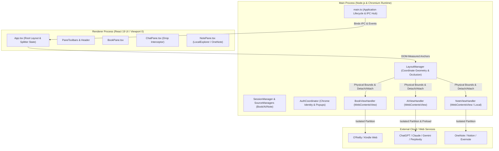

# Workbench — Reference Design Document (RDD)

**Version:** 1.0  
**Target:** Desktop Technical Reading, AI Synthesis & Knowledge Workspace  
**Stack:** Electron 34, React 19, TypeScript 5.7, Vite 6  
**Repository Root:** `d:\Products\Workbench`

---

## 1. System Architecture & Process Model

Workbench is architected as a high-performance multi-view desktop workspace that pairs digital technical reading platforms with multi-provider generative AI assistants and local/cloud notebook systems.



### Architectural Principles:
1. **`WebContentsView` over deprecated `<webview>`**: Guest web sessions run as native `WebContentsView` children attached directly to the `BrowserWindow.contentView`, guaranteeing modern Chromium process isolation, hardware acceleration, and memory containment.
2. **Strict Session Partitioning**: Each source retains isolated persistent storage (`persist:workbench-book-{id}`, `persist:workbench-ai-{id}`, `persist:workbench-note-{id}`), ensuring credential independence and zero cookie collision across accounts.
3. **Decoupled Presentation & Native Surfaces**: The React 19 renderer maintains UI controls, floating toolbars, and layout anchors, while the main process coordinates native coordinate geometry and view positioning.

---

## 2. Core Subsystems & Responsibilities

| Subsystem | Key Files | Primary Responsibilities |
| :--- | :--- | :--- |
| **Application & IPC Hub** | [`electron/main.ts`](file:///d:/Products/Workbench/electron/main.ts) | Window creation, IPC router, file system operations, drag-and-drop file transfers, system menus. |
| **Layout & Geometry** | [`electron/services/layoutManager.ts`](file:///d:/Products/Workbench/electron/services/layoutManager.ts) | Dual-axis coordinate calculation, DOM-measured anchor tracking, view detaching during modal display, ghost dragging state. |
| **Auth & Anti-Bot Engine** | [`electron/auth/authCoordinator.ts`](file:///d:/Products/Workbench/electron/auth/authCoordinator.ts), [`viewPreload.ts`](file:///d:/Products/Workbench/electron/views/viewPreload.ts) | Chrome User-Agent enforcement, Client Hints rewriting, `window.chrome` runtime API stubbing, OAuth popup containment. |
| **Source Management** | [`bookSourceManager.ts`](file:///d:/Products/Workbench/electron/services/bookSourceManager.ts), [`aiSourceManager.ts`](file:///d:/Products/Workbench/electron/services/aiSourceManager.ts), [`noteSourceManager.ts`](file:///d:/Products/Workbench/electron/services/noteSourceManager.ts) | Dynamic presets and user configurations stored in persistent JSON files under `userData`. |
| **View Handlers** | [`bookViewHandler.ts`](file:///d:/Products/Workbench/electron/views/bookViewHandler.ts), [`aiViewHandler.ts`](file:///d:/Products/Workbench/electron/views/aiViewHandler.ts), [`noteViewHandler.ts`](file:///d:/Products/Workbench/electron/views/noteViewHandler.ts) | Lifecycle management of guest web contents, zoom control, DOM extraction, and synthetic input insertion. |
| **Local Explorer & Notes** | [`src/components/LocalExplorer.tsx`](file:///d:/Products/Workbench/src/components/LocalExplorer.tsx), [`OneNoteApp.tsx`](file:///d:/Products/Workbench/src/components/OneNoteApp.tsx) | Direct filesystem file explorer, tree view, inline viewer/editor, and file staging. |

---

## 3. Layout, Geometry & View Occlusion Engine

Managing native `WebContentsView` surfaces alongside web modals and splitters requires specialized synchronization to avoid z-index clobbering:

1. **Dual Splitter Architecture**:
   - **Column Splitter (X-Axis)**: Divides Left Column (Reading View) and Right Stack (Chat + Notes) from 15% to 85% width.
   - **Row Splitter (Y-Axis)**: Subdivides Right Column between ChatView (top) and NoteView (bottom) from 15% to 85% height.
2. **Ghost Dragging ("Approach B")**:
   - During active splitter dragging, native `WebContentsView` bounds are set off-screen (`x: -10000, y: -10000`) and hidden. A lightweight React preview bar renders at 60 FPS.
   - On `pointerup`, the calculated split ratio snaps to position and native views are repositioned.
3. **Modal View Occlusion Prevention**:
   - Because native `WebContentsView` layers render above all HTML DOM elements regardless of CSS `z-index`, `LayoutManager.setViewsVisible(false)` physically removes child views via `mainWindow.contentView.removeChildView()` whenever configuration or credential modals open.

---

## 4. Cross-Pane Data Movement & Flow Matrix

```
[ Bookview (Reading) ]
        │
        ├───────── Highlight Text + Ask AI ─────────► [ Chatview (AI Assistant) ]
        │          (Prompt Template Injection)                  │
        │                                                       ├─ Extract Response ─┐
        ├───────── Clip Selection (Ctrl+Shift+N) ─┐             ├─ Extract Code ─────┼─► [ Noteview / Local Notes ]
        │                                         ▼             └─ Export Transcript ┘   (Markdown / Files)
        └─────────────────────────────────► [ Noteview ]                 ▲
                                                  │                      │
                                                  └─── Drag & Drop / ────┘
                                                       Send File to AI
```

### 1. Reading to AI ("Ask AI")
- **Trigger**: Highlight text in Bookview + toolbar menu or `Ctrl+Shift+A`.
- **Extraction**: `bookHandler.extractSelection()` executes `window.getSelection().toString()` inside Bookview.
- **Injection**: `aiHandler.doAskAI()` wraps text in structured templates (`explain`, `summarize`, `code`, `quiz`, `custom`) and synthetically injects it into the AI prompt input (`#prompt-textarea`, `div[contenteditable="true"]`, or `textarea`) using `document.execCommand('insertText')` + `InputEvent`. System clipboard is updated as fallback.

### 2. Chatview to Noteview ("Save to Note" & Code Extraction)
- **Smart Response Capture**: `aiHandler.extractLastResponse()` locates the latest assistant DOM nodes (`[data-message-author-role="assistant"]`, `.font-claude-message`, or `article`), parses preceding user prompt, and formats as timestamped Markdown block.
- **Code Block Parsing**: `aiHandler.extractCodeBlocks()` parses `<pre><code>` elements, maps language classes to standard file extensions (`.py`, `.ts`, `.sql`, etc.), and stages them for 1-click filesystem saving via `saveAIContent({ type: 'code' })`.
- **Full Session Archival**: `aiHandler.extractFullTranscript()` iterates through conversation turns and exports a complete Markdown transcript to local notes.

### 3. Noteview to Chatview (File & Snippet Transfer)
- **Local File Upload Injection**: `aiHandler.sendFileToAI()` reads local files into a binary buffer, converts to `Blob` / `File`, and programmatically populates the AI web client's `input[type="file"]` via synthetic `DataTransfer` events.
- **Drag-and-Drop Bridge**: Injected drop interceptors in `viewPreload.ts` trap OS and cross-pane file drop events, preventing Chromium from inserting literal file paths into textareas and ensuring authentic file attachment.

---

## 5. IPC Interface Contract & Protocol

| IPC Channel | Direction | Type | Payload / Signature | Purpose |
| :--- | :--- | :--- | :--- | :--- |
| `workbench:update-bounds` | Renderer → Main | `send` | `{ book, ai, note }: DOMBounds` | Synchronizes native views with DOM anchor rects. |
| `workbench:set-split` | Renderer → Main | `send` | `{ ratio: number, isSwapped: boolean }` | Sets horizontal split ratio and pane swapping. |
| `workbench:set-vertical-split` | Renderer → Main | `send` | `{ ratio: number }` | Sets vertical ratio between Chat and Notes. |
| `workbench:set-views-visible` | Renderer → Main | `send` | `boolean \| { target, visible }` | Controls native view detachment for modal display. |
| `workbench:set-views-dragging`| Renderer → Main | `send` | `isDragging: boolean` | Disables native views during splitter drag operations. |
| `workbench:nav-action` | Renderer → Main | `send` | `{ target, command }` | Dispatches back, forward, reload, home, or zoom. |
| `workbench:nav-state` | Main → Renderer | `event` | `(target, NavState)` | Updates renderer navigation buttons and URL status. |
| `workbench:ask-ai` | Renderer → Main | `invoke` | `{ templateKey, customPrompt }` | Extracts Bookview selection and injects AI prompt. |
| `workbench:send-file-to-ai` | Renderer → Main | `invoke` | `{ filePath, instruction? }` | Attaches local file to active AI chat interface. |
| `workbench:send-text-to-ai` | Renderer → Main | `invoke` | `{ text, templateKey? }` | Sends arbitrary text into AI chat input. |
| `workbench:save-ai-content` | Renderer → Main | `invoke` | `{ type, targetDir?, activeFilePath? }` | Saves AI response, code blocks, or full transcript. |
| `workbench:clear-session` | Renderer → Main | `invoke` | `(target, scope)` | Clears cookies, cache, and storage for a source. |
| `workbench:read-directory` | Renderer → Main | `invoke` | `dirPath: string` | Scans filesystem for LocalExplorer file tree. |

---

## 6. Authentication Coordination & Browser Fingerprinting

To allow secure embedded authentication into third-party providers (Google SSO, Microsoft, Apple, OpenAI, Anthropic), Workbench employs an active fingerprint emulation layer:

1. **User-Agent Normalization**: Enforces genuine Desktop Chrome User-Agent across all sessions, popups, and requests via `app.userAgentFallback` and `session.setUserAgent()`.
2. **Client Hints Alignment**: `AuthCoordinator` rewrites outgoing HTTP request headers (`sec-ch-ua`, `sec-ch-ua-platform`, `sec-ch-ua-mobile`) to match the platform string.
3. **Chrome Runtime Stubs**: `viewPreload.ts` runs in Chromium isolated world `0` prior to page execution:
   - Emulates `window.chrome.app`, `window.chrome.csi()`, and `window.chrome.loadTimes()`.
   - Injects authentic `navigator.userAgentData` with `getHighEntropyValues()`.
   - Populates standard `navigator.plugins` (Chrome PDF Viewer).
   - Masks `navigator.webdriver = false` and disables Blink `AutomationControlled` flags.
4. **Popup Interception**: `handleWindowOpen()` inspects popup requests: allows known OAuth/SSO dialogs inside centered child windows; diverts non-auth external web links to the system desktop browser.

---

## 7. Directory Structure & Key Files

```
d:\Products\Workbench\
├── docs\
│   └── REFERENCE_DESIGN_DOCUMENT.md      # This architectural reference specification
├── electron\
│   ├── auth\
│   │   ├── authCoordinator.ts           # Unified authentication and popup manager
│   │   └── strategies\                  # Google, Microsoft, Apple & default auth strategies
│   ├── services\
│   │   ├── layoutManager.ts             # Geometry calculation and native view manager
│   │   ├── sessionManager.ts            # Partition lifecycle and credential deletion
│   │   ├── bookSourceManager.ts         # Reading source configuration store
│   │   ├── aiSourceManager.ts           # AI assistant source configuration store
│   │   └── noteSourceManager.ts         # Notebook and local explorer configuration store
│   ├── views\
│   │   ├── bookViewHandler.ts           # Bookview WebContentsView handler
│   │   ├── aiViewHandler.ts             # AI ChatView WebContentsView handler
│   │   ├── noteViewHandler.ts           # Noteview WebContentsView & local bridge
│   │   └── viewPreload.ts               # Guest view anti-bot & drop preload script
│   ├── main.ts                          # Main process entrypoint & IPC dispatchers
│   └── preload.ts                       # Context bridge exposing window.electron APIs
├── src\
│   ├── components\
│   │   ├── panes\                       # BookPane.tsx, ChatPane.tsx, NotePane.tsx
│   │   ├── LocalExplorer.tsx            # Local filesystem tree, editor, & note manager
│   │   ├── OneNoteApp.tsx               # Embedded/local note scratchpad
│   │   ├── PaneToolbar.tsx              # Universal pane navigation, source selector & actions
│   │   ├── Header.tsx                   # Top app bar, preset ratios & pane visibility toggles
│   │   ├── Splitter.tsx                 # Column splitter with ghost preview
│   │   └── HorizontalSplitter.tsx       # Row splitter with ghost preview
│   ├── types\
│   │   └── electron.d.ts                # TypeScript interface declarations for IPC bridge
│   ├── App.tsx                          # Top-level React container & state coordinator
│   └── App.css                          # Complete design system tokens & layout styling
├── package.json                         # Scripts & runtime dependencies
└── vite.config.ts                       # Vite build configuration & Electron plugins
```
