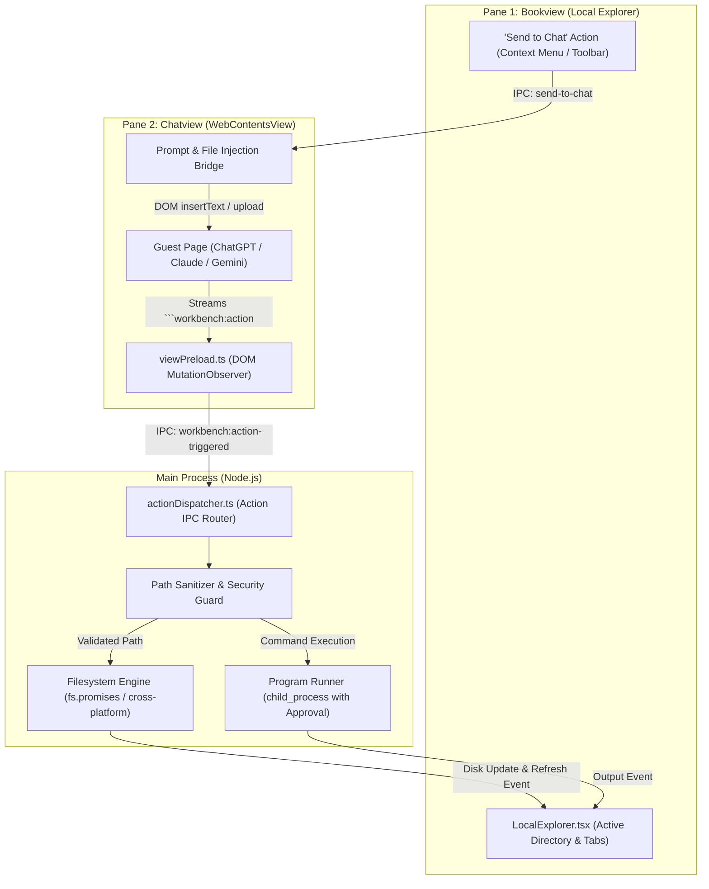

# Workbench — Action Model & Web-Bridge Design Document

**Version:** 1.0  
**Feature Branch:** `feature/workbench-action-model`  
**Target:** Natural Language Local Automation & Program Creation from Any AI Chat  
**Platforms:** Windows 10/11 & macOS (Universal / Apple Silicon & Intel)  
**Stack:** Electron 34, React 19, TypeScript 5.7, Node.js `fs`/`path`, Chromium `MutationObserver`

---

## 1. Executive Summary & Vision

The **Workbench Action Model** provides a bidirectional semantic bridge between cloud-hosted generative AI chats (ChatGPT, Claude, Gemini, DeepSeek, etc.) and the local Workbench desktop environment (Bookview Local Explorer, Noteview, and the local file system).

Users can converse naturally with any AI model inside the Chatview pane and instruct it to:
1. **Organize & Manage Files/Folders**: Create folders, move files, rename, and batch-organize local directories visible in Bookview.
2. **Create & Scaffold Programs**: Generate complete scripts, source code files, or entire multi-file project scaffolds in any language (Python, JavaScript, Go, Rust, HTML, Shell) directly onto the local disk and open them in tabs.
3. **Move Files & Selections into Chat**: Dispatch active documents, highlighted code snippets, or local files from Explorer directly into the AI prompt box with 1 click.
4. **Execute Routines Safely**: Non-destructive operations run seamlessly with ambient toasts; destructive operations (deletions, overwrites) require explicit user authorization.

---

## 2. Architectural Comparison: Web Bridge vs. API MCP

| Dimension | Standard API MCP (`stdio`/SSE) | Workbench Web Bridge (`workbench:action`) |
| :--- | :--- | :--- |
| **Account & Cost** | Requires API keys with pay-per-token billing | **$0 extra**: Uses existing $20/mo flat-rate ChatGPT Plus / Claude Pro web accounts |
| **UI Environment** | Requires building a custom chat client or external tool | **Official Web UI**: Preserves native Canvas, Artifacts, Voice, Custom GPTs, and chat history |
| **Model Support** | Dependent on provider's tool-calling API | **100% Universal**: Works across ChatGPT, Claude, Gemini, DeepSeek, and custom platforms |
| **Execution Wire** | JSON-RPC 2.0 messages over standard I/O | Standard Markdown JSON blocks parsed via DOM `MutationObserver` & Electron IPC |
| **Local Authority** | Host process executes Node.js tools | Workbench Node.js backend executes sanitized filesystem tools |

---

## 3. High-Level System Architecture



---

## 4. Universal Action Primitives (Specification)

Every action is represented as a structured JSON object enclosed in a Markdown code block with language identifier `workbench:action` (or `workbench`).

```json
```workbench:action
{
  "type": "<action_type>",
  "params": { ... }
}
```
```

### 4.1. Core Action Catalog

#### 1. `create_folder`
Creates single or deeply nested directories inside the active explorer path.
- **Parameters**:
  - `name` (string, required): Directory name or relative path (e.g. `"Chapter 2"` or `"src/components/common"`).
  - `path` (string, optional): Base directory relative to explorer root (defaults to active folder).

#### 2. `write_file` (Program & Note Creation)
Creates or overwrites a file with content generated by the AI.
- **Parameters**:
  - `name` (string, required): File name with extension (e.g. `"scraper.py"`, `"index.html"`, `"Summary.md"`).
  - `content` (string, required): Complete source code or text.
  - `path` (string, optional): Subfolder destination.
  - `openInTab` (boolean, optional, default: `true`): Automatically opens the new file in Local Explorer.

#### 3. `create_project` (Multi-File Scaffold)
Generates an entire project structure in one atomic step.
- **Parameters**:
  - `folder` (string, required): Root project directory name.
  - `files` (array, required): Array of `{ name: string, path?: string, content: string }`.

#### 4. `move_file` / `rename_file`
Moves or renames files or directories within the explorer hierarchy.
- **Parameters**:
  - `source` (string, required): Source file or folder relative path.
  - `target` (string, required): Destination directory or new file name.

#### 5. `copy_file`
Duplicates a file or folder.
- **Parameters**:
  - `source` (string, required): Source relative path.
  - `target` (string, required): Destination relative path.

#### 6. `delete_file`
Safely moves files or directories to the system Trash / Recycle Bin (or permanently deletes with confirmation).
- **Parameters**:
  - `name` (string, required): Target file or folder path.
- **Safety Policy**: **Requires explicit user prompt** (`[Allow / Deny]`).

#### 7. `open_file`
Switches the active Local Explorer viewer tab to the specified file.
- **Parameters**:
  - `name` (string, required): File path to open.

#### 8. `run_program` (Interactive Script Execution)
Executes a local command or script in the active project directory.
- **Parameters**:
  - `command` (string, required): Command to execute (e.g. `"python main.py"` or `"npm test"`).
  - `cwd` (string, optional): Working directory.
- **Safety Policy**: **Always prompts user approval before executing external processes.**

#### 9. `batch`
Executes an array of actions sequentially in one turn.
- **Parameters**:
  - `actions` (array, required): Array of individual action objects.

---

## 5. Security & Sandbox Guardrails

To protect user systems against unintended file operations:

1. **Path Traversal Containment**:
   - All input paths (`name`, `path`, `source`, `target`) are canonicalized using `path.resolve()`.
   - The engine validates: `targetPath.startsWith(activeExplorerRoot)`.
   - Any attempt to escape the active root using `../../` or absolute drive roots (`C:\Windows`, `/etc/`) is rejected immediately with a security exception.
2. **Action Classification**:
   - **Safe (Auto-Execute)**: `create_folder`, `write_file` (new files), `copy_file`, `open_file`.
   - **Guarded (User Confirmation Modal)**: `delete_file`, `write_file` (overwriting existing files), `run_program`.
3. **Action Deduplication**:
   - As LLMs stream text, the DOM `MutationObserver` receives partial tokens.
   - The bridge computes a hash or unique ID per action block and marks it as `executed`, preventing duplicate runs while the message is rendering.

---

## 6. Cross-Platform Standards (Windows & macOS)

| Aspect | Implementation Rule |
| :--- | :--- |
| **Path Separators** | Use Node.js `path.join()`, `path.resolve()`, and `path.normalize()`. Never hardcode `\` or `/`. |
| **File Deletions** | Use Electron's native `shell.trashItem()` to send files to the OS Recycle Bin (Windows) or Trash (macOS) instead of irreversible `fs.unlink()`. |
| **Line Endings** | Normalizes all injected text to standard `\n` line breaks. |
| **Execution Commands** | Windows executes via `powershell.exe` / `cmd.exe`; macOS executes via `/bin/sh` or `/bin/zsh`. |

---

## 7. User Interaction Flow Scenarios

### Scenario A: Creating a Folder from Chat
1. User types in ChatGPT: *"Create a folder called 'Chapter 2' in my Bookview explorer."*
2. ChatGPT responds with:
   ````markdown
   ```workbench:action
   {"type": "create_folder", "params": {"name": "Chapter 2"}}
   ```
   ````
3. Injected bridge intercepts block $\rightarrow$ IPC to Main process.
4. Main process executes `fs.promises.mkdir()` $\rightarrow$ Emits `workbench:explorer-refresh-needed`.
5. Local Explorer reloads its directory tree $\rightarrow$ An ambient toast displays: `✔ Created folder "Chapter 2"`.

### Scenario B: Generating & Opening a Python Program
1. User types in Claude: *"Write a Python script called `fetch_data.py` that fetches JSON from a test API, and save it in my current explorer folder."*
2. Claude outputs:
   ````markdown
   ```workbench:action
   {
     "type": "write_file",
     "params": {
       "name": "fetch_data.py",
       "content": "import urllib.request\nimport json\n\n...",
       "openInTab": true
     }
   }
   ```
   ````
3. File is written to disk $\rightarrow$ Local Explorer opens `fetch_data.py` in an active code tab.

### Scenario C: Sending a File from Explorer to Chat
1. User right-clicks `notes.md` in Local Explorer $\rightarrow$ Clicks **"Send to Active Chat"**.
2. Workbench reads `notes.md` from disk.
3. Injects formatted prompt into ChatGPT/Claude's input textarea:
   ```
   --- File: notes.md ---
   [file contents]
   ```
4. Focuses the chat input field, ready for the user to add instructions or press Enter.

---

---

## 8. Modular Action Architecture & Extensibility

All actions in Workbench are structured as **independent, pluggable modules** located in `electron/actions/`.

### 8.1. Directory Structure

```
electron/actions/
├── types.ts                # ActionDefinition, ActionContext, ActionResult interfaces
├── registry.ts             # ActionRegistry (singleton with dynamic prompt generator)
├── createFolderAction.ts   # 'create_folder', 'mkdir', 'new_folder'
├── writeFileAction.ts      # 'write_file', 'create_file', 'save_file'
├── createProjectAction.ts  # 'create_project', 'scaffold_project'
├── fileOpsActions.ts       # 'move_file', 'copy_file', 'rename_file'
├── deleteFileAction.ts     # 'delete_file', 'remove_file'
├── openFileAction.ts       # 'open_file', 'show_file'
├── batchAction.ts          # 'batch' (sequential action executor)
└── index.ts                # Built-in registration & barrel exports
```

### 8.2. Action Definition Interface

Every action implements the `ActionDefinition` interface:

```typescript
export interface ActionDefinition {
  /** Primary action identifier, e.g. 'create_folder' */
  id: string
  /** Synonyms/aliases that LLMs might emit, e.g. ['mkdir', 'new_folder'] */
  aliases?: string[]
  /** Human & LLM readable description */
  description: string
  /** Parameters schema for automated LLM documentation */
  parameters: Record<string, { type: string; required?: boolean; description: string }>
  /** Canonical JSON example */
  example: Record<string, any>
  /** Safe local execution logic */
  execute(ctx: ActionContext, payload: any, targetPane?: 'book' | 'note'): Promise<ActionResult>
}
```

### 8.3. Creating a New Modular Action (Using ChatGPT or Claude)

To create a new action, simply add a new TypeScript file in `electron/actions/` and register it in `registry.ts`:

#### Example Prompt to Ask ChatGPT:
> *"I am extending the Workbench Desktop Action Model. Write a new modular action file implementing `ActionDefinition` that [describe what you want the action to do, e.g., run a Python unit test, generate a Markdown table, or format a file]. Use the ActionContext methods `resolveSafePath`, `notify`, and `refreshExplorer`."*

#### Example Implementation (`formatFileAction.ts`):
```typescript
import fs from 'node:fs'
import { ActionDefinition, ActionContext, ActionResult } from './types'

export const formatFileAction: ActionDefinition = {
  id: 'format_file',
  aliases: ['beautify_file'],
  description: 'Cleans up whitespace and formats a text or code file.',
  parameters: {
    path: { type: 'string', required: true, description: 'File path to format' },
  },
  example: { action: 'format_file', path: 'script.py' },
  async execute(ctx: ActionContext, payload: any, targetPane = 'book'): Promise<ActionResult> {
    const filePath = ctx.resolveSafePath(payload.path || payload.params?.path, targetPane)
    const content = await fs.promises.readFile(filePath, 'utf-8')
    const formatted = content.trim() + '\n'
    await fs.promises.writeFile(filePath, formatted, 'utf-8')
    ctx.notify(`✨ Formatted: ${payload.path}`)
    return { success: true, message: `Formatted ${payload.path}` }
  },
}
```

Register it in `electron/actions/index.ts`:
```typescript
registry.register(formatFileAction)
```

Once registered:
1. `ActionDispatcher` can immediately execute it.
2. `ActionRegistry.generatePromptGuide()` automatically includes it in the prompt given to ChatGPT/Claude.

---

## 9. Dual Execution & Detection Model

To guarantee 100% reliability regardless of browser sandboxing or DOM updates:

1. **Active Live Scanner (`scanAndExecutePendingActions`)**:
   - `aiViewHandler.ts` scans the live `WebContentsView` DOM directly via `executeJavaScript`.
   - Runs automatically in the background every 2 seconds when the AI chat pane is active.
   - Also triggers immediately when the user clicks the **"⚡ Run Action"** button in the AI toolbar.
2. **Injected Preload Observer (`viewPreload.ts`)**:
   - A `MutationObserver` runs inside the chat page to catch action blocks as they are streamed.
   - Attaches a visual `⚡ Executed in Workbench` badge directly below the action code block in the chat.
3. **Action Dispatcher (`actionDispatcher.ts`)**:
   - Validates paths, enforces safety boundaries, calls the registered modular handler, notifies the UI, and requests explorer refresh.

---

## 10. Implementation Status

- [x] **Modular Action System**: Complete action registry and separate modules in `electron/actions/`.
- [x] **Core Action Primitives**: `create_folder`, `write_file`, `create_project`, `move_file`, `copy_file`, `rename_file`, `delete_file`, `open_file`, `batch`.
- [x] **Action Dispatcher Service**: Decoupled from monolithic logic, supports custom action registration and auto-generated system prompt guides.
- [x] **Active Web Scanner & Live Execution**: Direct `scanAndExecutePendingActions` in `aiViewHandler.ts`.
- [x] **Toolbar Integration**:
  - `⚡ Action Prompt`: Copies the dynamic prompt guide containing all registered actions.
  - `⚡ Run Action`: Scans the active chat view and executes any pending action immediately.
- [x] **Local Explorer Synchronization**: Auto-refreshes file tree and opens created files in editor tabs.

